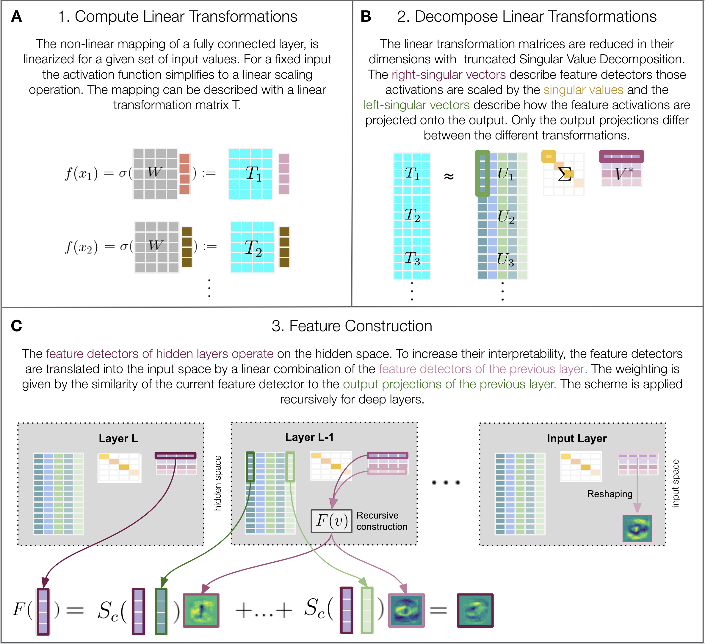

# Analysis of Linearized Layer Transformations

Deep neural networks provide impressive state-of-the-art performance while remaining hardly interpretable. Analysis of Linearized Layer Transformations (ALLT) aims at enhancing the network's interpretability by analysing the weights of the network. ALLT combines techniques from linearization, dimensionality reduction and feature visualisation to make network computations tractable. A detailed description of the method and results can be found [here](Lab_Report.pdf). 

> The schematic method



### Installation
To install the package locally, navigate to the `LinarizedLayerTransformations` directory and run
```commandline
pip install -e .
```
Initialise the remainder of the project skeleton:
```commandline
mkdir data docs results tests
```
The intended contents of each of these directories
is explained in the [Good Research Code Handbook](https://goodresearch.dev/setup.html#create-a-project-skeleton).

Now you should be able to run the scripts, for example:
```commandline
python scripts/train_logical_network.py
```

